# Python Beginner Course - Lesson Flowcharts

Complete mermaid charts showing the logical progression and concept dependencies for all 12 courses (122 lessons).

---

## Course 01: Python Fundamentals (11 lessons)

```mermaid
graph TD
    subgraph foundations["Phase 1: Foundations"]
        L01["<b>Lesson 1</b><br/>What is Programming?"]
        L01a("Programs as<br/>step-by-step instructions")
        L01b("Python overview &<br/>use cases")
        L01c("High-level vs<br/>machine language")
        L01d("Line-by-line<br/>execution model")

        L01 --- L01a
        L01 --- L01b
        L01 --- L01c
        L01 --- L01d
    end

    subgraph setup["Phase 2: Environment Setup"]
        L02["<b>Lesson 2</b><br/>Installing Python & IDE"]
        L02a("Python 3 installation<br/>& PATH setup")
        L02b("VS Code + Python<br/>extension")
        L02c("REPL interactive<br/>shell")
        L02d(".py files &<br/>running programs")

        L02 --- L02a
        L02 --- L02b
        L02 --- L02c
        L02 --- L02d

        L11["<b>Lesson 11</b><br/>Google Colab Setup"]
        L11a("Cloud-based Python<br/>no install needed")
        L11b("Code cells &<br/>text cells")
        L11c("Save to Google Drive<br/>& share")

        L11 --- L11a
        L11 --- L11b
        L11 --- L11c
    end

    subgraph core_io["Phase 3: Core I/O"]
        L03["<b>Lesson 3</b><br/>Your First Python Program"]
        L03a("Hello World &<br/>print function")
        L03b("Syntax rules &<br/>reading errors")
        L03c("Strings intro:<br/>quotes & text")

        L03 --- L03a
        L03 --- L03b
        L03 --- L03c

        L04["<b>Lesson 4</b><br/>Print & Input"]
        L04a("input function &<br/>user interaction")
        L04b("Variables intro:<br/>storing values")
        L04c("f-strings &<br/>string formatting")

        L04 --- L04a
        L04 --- L04b
        L04 --- L04c
    end

    subgraph data_skills["Phase 4: Data Skills"]
        L05["<b>Lesson 5</b><br/>Basic Math Operations"]
        L05a("Arithmetic operators<br/>+ - * / // % **")
        L05b("Operator precedence<br/>PEMDAS")
        L05c("int & float<br/>type conversion")
        L05d("Practical calculators<br/>& formulas")

        L05 --- L05a
        L05 --- L05b
        L05 --- L05c
        L05 --- L05d

        L06["<b>Lesson 6</b><br/>Strings Basics"]
        L06a("len, indexing<br/>& slicing")
        L06b("String methods:<br/>upper lower strip replace")
        L06c("Concatenation &<br/>repetition")
        L06d("Escape characters<br/>& triple quotes")

        L06 --- L06a
        L06 --- L06b
        L06 --- L06c
        L06 --- L06d
    end

    subgraph quality["Phase 5: Code Quality"]
        L07["<b>Lesson 7</b><br/>Comments & Code Style"]
        L07a("Comments: # and<br/>docstrings")
        L07b("PEP 8 style guide<br/>basics")
        L07c("snake_case naming &<br/>ALL_CAPS constants")
        L07d("Readable, self-<br/>documenting code")

        L07 --- L07a
        L07 --- L07b
        L07 --- L07c
        L07 --- L07d
    end

    subgraph integration["Phase 6: Integration & Mastery"]
        L08["<b>Lesson 8</b><br/>Simple Programs Workshop"]
        L08a("4-step dev process:<br/>plan-code-test-improve")
        L08b("Building 3 complete<br/>programs from scratch")
        L08c("Peer code review<br/>& feedback")

        L08 --- L08a
        L08 --- L08b
        L08 --- L08c

        L09["<b>Lesson 9</b><br/>Debugging Basics"]
        L09a("3 error types: syntax<br/>runtime & logic")
        L09b("Reading tracebacks<br/>& error messages")
        L09c("Print debugging<br/>technique")

        L09 --- L09a
        L09 --- L09b
        L09 --- L09c

        L10["<b>Lesson 10</b><br/>Review & Mini Project"]
        L10a("Full concept review<br/>& quiz")
        L10b("Multi-function<br/>calculator capstone")
        L10c("if/elif preview &<br/>menu-driven programs")

        L10 --- L10a
        L10 --- L10b
        L10 --- L10c
    end

    C02["<b>Course 2</b><br/>Data Types & Variables"]

    L01 -->|"Understand programming<br/>concepts"| L02
    L02 -->|"Environment ready<br/>to code"| L03
    L03 -->|"Can produce output<br/>needs interaction"| L04
    L04 -->|"Can get text input<br/>needs math"| L05
    L05 -->|"Numbers mastered<br/>deepen text skills"| L06
    L06 -->|"Know data types<br/>need clean style"| L07
    L07 -->|"Style mastered<br/>combine everything"| L08
    L08 -->|"Built programs<br/>need error skills"| L09
    L09 -->|"Can debug<br/>ready for capstone"| L10
    L10 -->|"Course 1 complete"| C02

    L02 -.->|"Alternative<br/>environment"| L11
    L11 -.->|"Cloud option<br/>for Course 2"| C02
    L03b -.->|"Error reading skills<br/>deepen in L9"| L09
    L05c -.->|"Type conversion<br/>reused in all programs"| L08

    classDef lessonNode fill:#4A90D9,stroke:#2C5F8A,color:#fff,font-weight:bold
    classDef conceptNode fill:#E8F4FD,stroke:#4A90D9,color:#333,font-size:11px
    classDef supplementNode fill:#7BC47F,stroke:#4A9050,color:#fff,font-weight:bold
    classDef nextCourse fill:#F5A623,stroke:#D4891A,color:#fff,font-weight:bold

    class L01,L02,L03,L04,L05,L06,L07,L08,L09,L10 lessonNode
    class L11 supplementNode
    class L01a,L01b,L01c,L01d,L02a,L02b,L02c,L02d,L03a,L03b,L03c,L04a,L04b,L04c,L05a,L05b,L05c,L05d,L06a,L06b,L06c,L06d,L07a,L07b,L07c,L07d,L08a,L08b,L08c,L09a,L09b,L09c,L10a,L10b,L10c,L11a,L11b,L11c conceptNode
    class C02 nextCourse
```

---

## Course 02: Data Types & Variables (10 lessons)

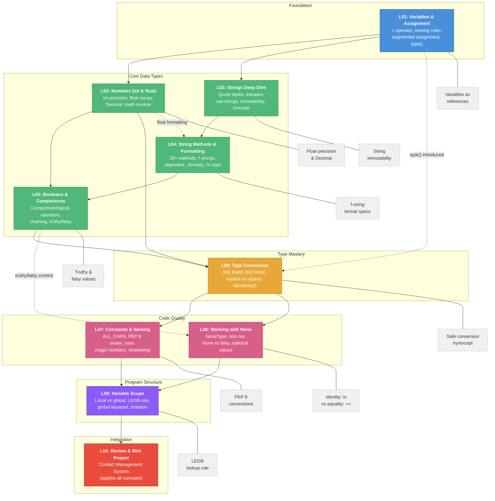

---

## Course 03: Control Flow & Logic (10 lessons)

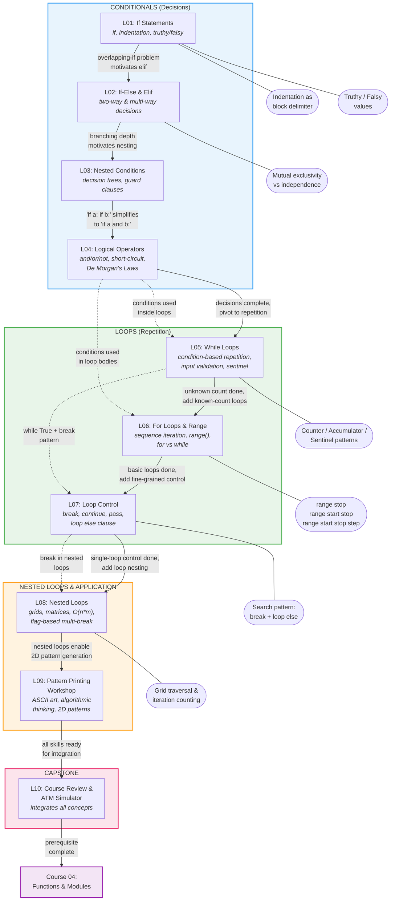

---

## Course 04: Functions & Modules (10 lessons)

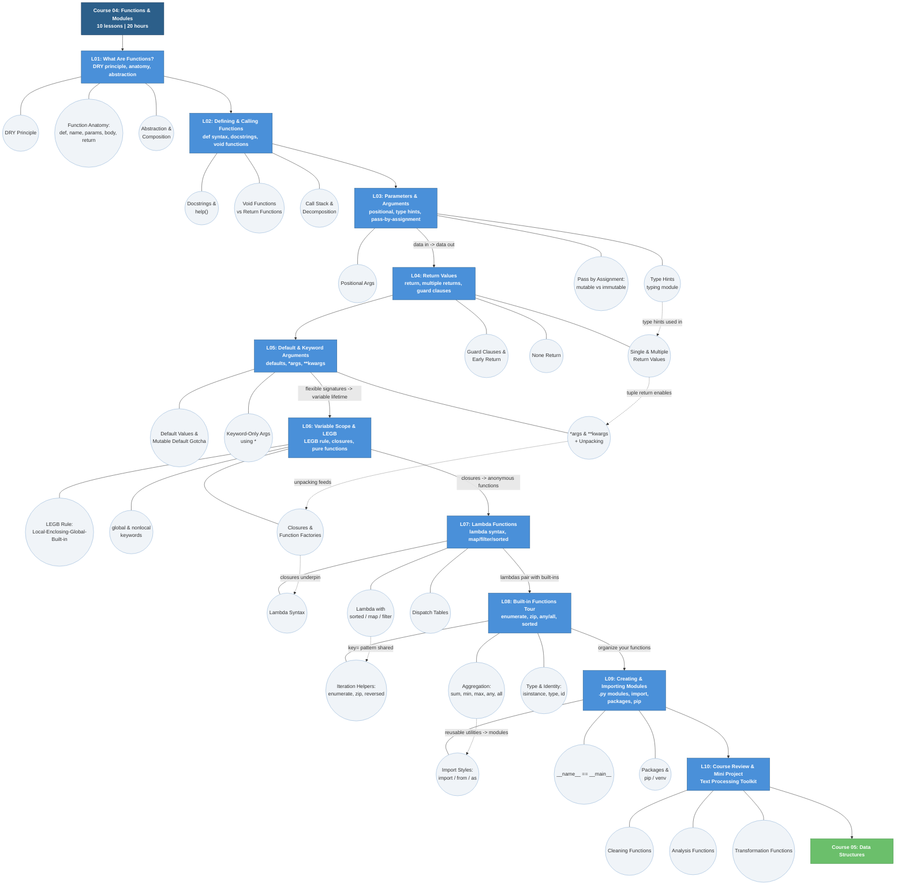

---

## Course 05: Data Structures (12 lessons)

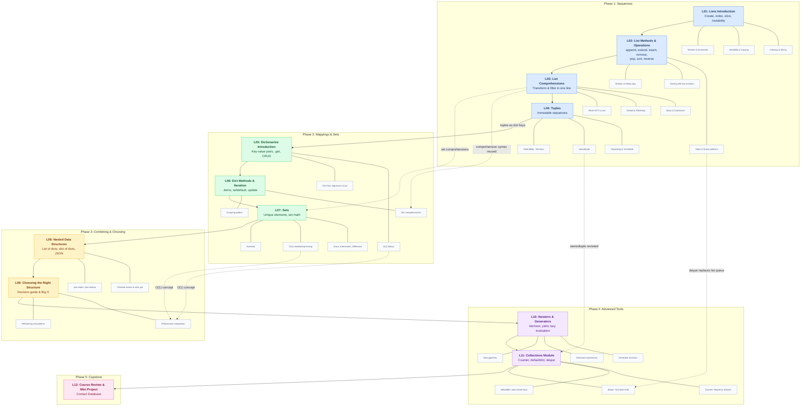

---

## Course 06: Object-Oriented Programming (10 lessons)

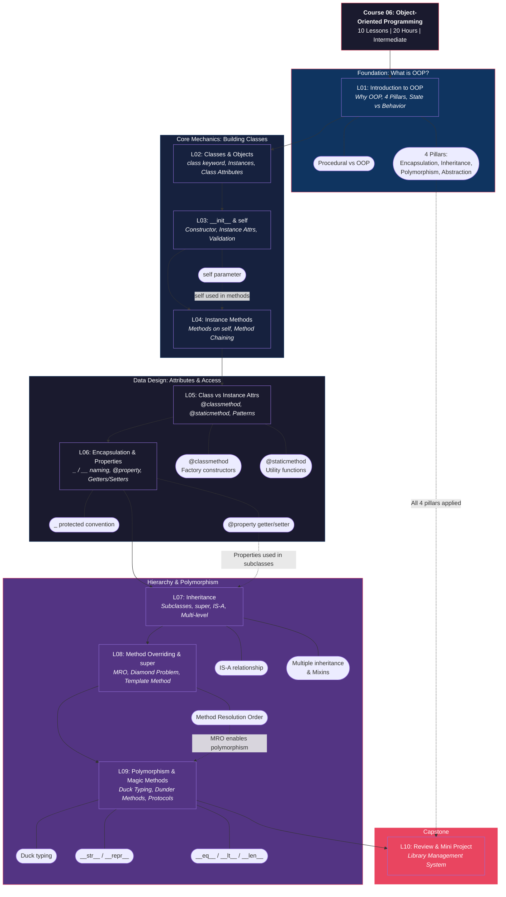

---

## Course 07: File Handling & Exceptions (10 lessons)

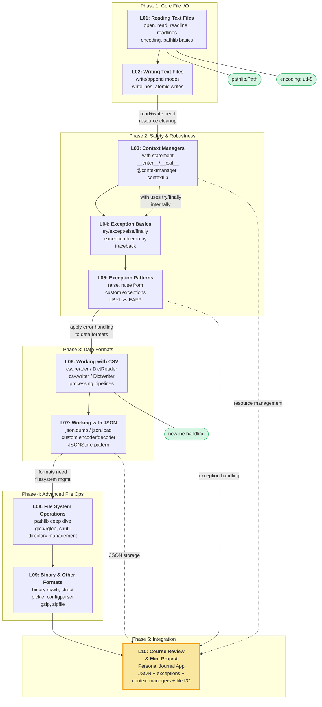

---

## Course 08: Working with Libraries (10 lessons)

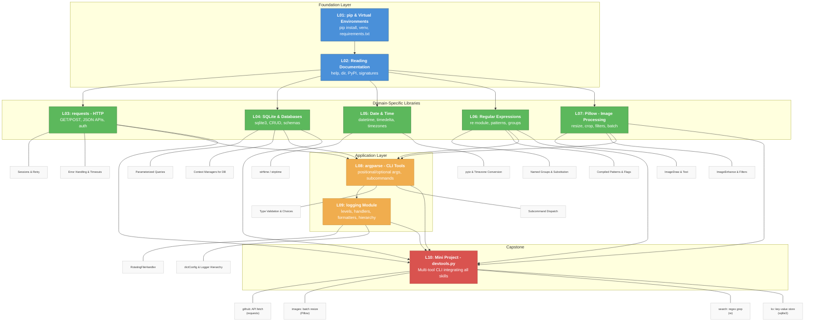

---

## Course 09: Web Development Basics (10 lessons)

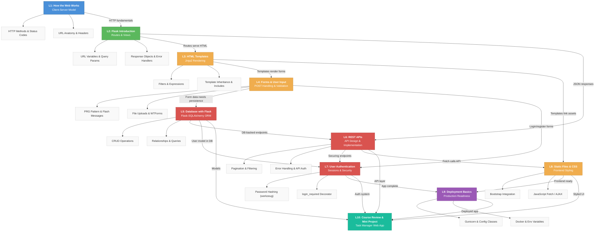

---

## Course 10: Data Analysis & Visualization (10 lessons)

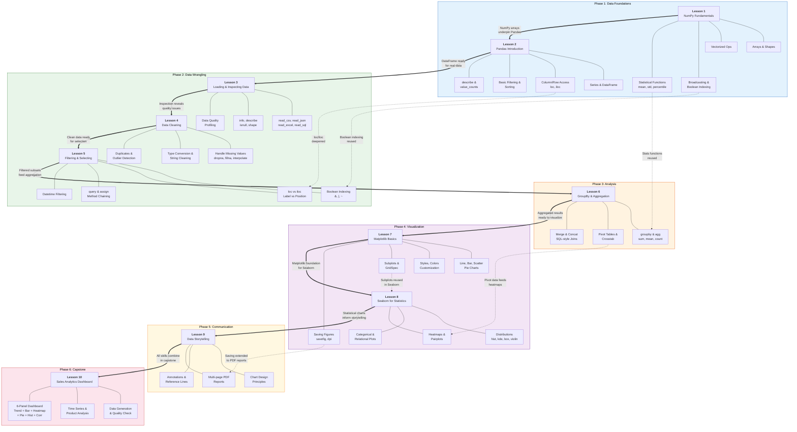

---

## Course 11: Automation & Scripting (10 lessons)

```mermaid
graph TD
    subgraph FoundationAS ["Foundation: System & Scheduling"]
        L1["<b>L1: Subprocess & OS Automation</b><br/>subprocess, os, shutil, pathlib"]
        L1a["Run shell commands"]
        L1b["File system operations"]
        L1c["Cross-platform scripts"]
        L1 --- L1a
        L1 --- L1b
        L1 --- L1c

        L2["<b>L2: Scheduled Tasks</b><br/>schedule, cron, APScheduler"]
        L2a["schedule library"]
        L2b["Cron syntax"]
        L2c["Error handling & retry"]
        L2 --- L2a
        L2 --- L2b
        L2 --- L2c
    end

    L1 -->|"scripts to schedule"| L2

    subgraph Acquisition ["Data Acquisition: Web & APIs"]
        L3["<b>L3: Web Scraping (BeautifulSoup)</b><br/>requests, bs4, lxml"]
        L3a["HTML parsing & CSS selectors"]
        L3b["Pagination & rate limiting"]
        L3c["Ethical scraping / robots.txt"]
        L3 --- L3a
        L3 --- L3b
        L3 --- L3c

        L4["<b>L4: Browser Automation (Selenium)</b><br/>WebDriver, explicit waits"]
        L4a["JS-rendered pages"]
        L4b["Form filling & interaction"]
        L4c["Screenshots on failure"]
        L4 --- L4a
        L4 --- L4b
        L4 --- L4c

        L7["<b>L7: API Integration & Webhooks</b><br/>REST, OAuth 2.0, Flask"]
        L7a["Slack / Telegram APIs"]
        L7b["OAuth 2.0 flow"]
        L7c["Webhook receivers"]
        L7 --- L7a
        L7 --- L7b
        L7 --- L7c
    end

    L3 -->|"static HTML -> dynamic JS"| L4
    L3 -->|"HTTP knowledge"| L7

    subgraph Output ["Output: Email, Spreadsheets, Notifications"]
        L5["<b>L5: Email Automation</b><br/>smtplib, MIME, Jinja2"]
        L5a["HTML email + attachments"]
        L5b["Email templates"]
        L5c["Bulk personalized email"]
        L5 --- L5a
        L5 --- L5b
        L5 --- L5c

        L6["<b>L6: Spreadsheet Automation</b><br/>openpyxl, pandas"]
        L6a["Read/write Excel"]
        L6b["Charts & styling"]
        L6c["Conditional formatting"]
        L6 --- L6a
        L6 --- L6b
        L6 --- L6c
    end

    L4 -->|"scraped data -> report"| L5
    L5 -->|"attach spreadsheet reports"| L6
    L7 -->|"notifications complement email"| L5

    subgraph Processing ["Processing: Files & ETL"]
        L8["<b>L8: File & Data Processing</b><br/>watchdog, ETL, concurrent.futures"]
        L8a["Batch & streaming processing"]
        L8b["Directory watching (watchdog)"]
        L8c["ETL pipeline pattern"]
        L8d["Concurrent processing"]
        L8 --- L8a
        L8 --- L8b
        L8 --- L8c
        L8 --- L8d
    end

    L1 -->|"file ops foundation"| L8
    L6 -->|"spreadsheet data feeds pipeline"| L8

    subgraph QualityAS ["Quality: Testing & CI"]
        L9["<b>L9: Testing Automation Scripts</b><br/>pytest, mocking, GitHub Actions"]
        L9a["pytest fixtures & tmp_path"]
        L9b["Mock HTTP, SMTP, datetime"]
        L9c["Integration tests"]
        L9d["GitHub Actions CI"]
        L9 --- L9a
        L9 --- L9b
        L9 --- L9c
        L9 --- L9d
    end

    L8 -->|"test pipelines & processors"| L9
    L5 -->|"mock email sending"| L9
    L3 -->|"mock HTTP requests"| L9

    L10["<b>L10: Course Review & Mini Project</b><br/>Daily Report Bot"]
    L10a["Scrape -> Process -> Chart -> Excel -> Email"]
    L10b["Scheduled at 9 AM daily"]
    L10c["Full test suite"]
    L10 --- L10a
    L10 --- L10b
    L10 --- L10c

    L2 -->|"scheduling"| L10
    L3 -->|"data fetching"| L10
    L6 -->|"Excel report"| L10
    L5 -->|"email delivery"| L10
    L8 -->|"data pipeline"| L10
    L9 -->|"test coverage"| L10

    classDef foundationAS fill:#1565C0,color:#fff,stroke:#0D47A1
    classDef acquisition fill:#2E7D32,color:#fff,stroke:#1B5E20
    classDef output fill:#E65100,color:#fff,stroke:#BF360C
    classDef processing fill:#6A1B9A,color:#fff,stroke:#4A148C
    classDef qualityAS fill:#00838F,color:#fff,stroke:#006064
    classDef capstoneAS fill:#C62828,color:#fff,stroke:#B71C1C
    classDef subtopic fill:#F5F5F5,color:#333,stroke:#BDBDBD,stroke-width:1px

    class L1,L2 foundationAS
    class L3,L4,L7 acquisition
    class L5,L6 output
    class L8 processing
    class L9 qualityAS
    class L10 capstoneAS
    class L1a,L1b,L1c,L2a,L2b,L2c,L3a,L3b,L3c,L4a,L4b,L4c,L5a,L5b,L5c,L6a,L6b,L6c,L7a,L7b,L7c,L8a,L8b,L8c,L8d,L9a,L9b,L9c,L9d,L10a,L10b,L10c subtopic
```

---

## Course 12: Capstone Projects & Best Practices (10 lessons)

```mermaid
graph TD
    subgraph foundations12["Phase 1: Professional Foundations"]
        L01["<b>L01: Software Architecture</b><br/>SOLID, Layers, Design Patterns"]
        L01_a["SRP, OCP, DIP"]
        L01_b["Repository / Factory / Observer"]
        L01_c["Layered Architecture<br/>Presentation -> Business -> Data"]
        L01 --- L01_a
        L01 --- L01_b
        L01 --- L01_c
    end

    subgraph quality12["Phase 2: Quality & Safety"]
        L02["<b>L02: Testing Strategies</b><br/>Pyramid, TDD, pytest"]
        L02_a["Unit / Integration / E2E"]
        L02_b["TDD: Red -> Green -> Refactor"]
        L02_c["Fixtures, Parametrize, Coverage"]
        L02 --- L02_a
        L02 --- L02_b
        L02 --- L02_c

        L03["<b>L03: Code Quality & Style</b><br/>PEP 8, Linting, Type Hints"]
        L03_a["black + ruff + mypy"]
        L03_b["Type Hints & Protocols"]
        L03_c["Pre-commit Hooks"]
        L03 --- L03_a
        L03 --- L03_b
        L03 --- L03_c

        L04["<b>L04: Documentation</b><br/>Docstrings, README, API Docs"]
        L04_a["Google-style Docstrings"]
        L04_b["OpenAPI / Swagger"]
        L04_c["MkDocs / Doctest"]
        L04 --- L04_a
        L04 --- L04_b
        L04 --- L04_c
    end

    subgraph production12["Phase 3: Production Readiness"]
        L05["<b>L05: Security</b><br/>Secrets, Injection, Validation"]
        L05_a["Env vars & .gitignore"]
        L05_b["SQL Injection / XSS Prevention"]
        L05_c["Auth: Hashing, CSRF, Rate Limiting"]
        L05 --- L05_a
        L05 --- L05_b
        L05 --- L05_c

        L06["<b>L06: Performance</b><br/>Profiling, Caching, Async"]
        L06_a["cProfile / line_profiler"]
        L06_b["lru_cache / Flask-Caching"]
        L06_c["asyncio / aiohttp"]
        L06_d["N+1 Query Fixes"]
        L06 --- L06_a
        L06 --- L06_b
        L06 --- L06_c
        L06 --- L06_d
    end

    subgraph capstones12["Phase 4: Capstone Projects (Choose 1)"]
        L07["<b>L07: Blog Platform</b><br/>Full-stack Flask App"]
        L07_a["Auth + CRUD + REST API"]
        L07_b["Markdown, Tags, Comments"]
        L07_c["Admin Panel + Email Digest"]
        L07 --- L07_a
        L07 --- L07_b
        L07 --- L07_c

        L08["<b>L08: Analytics Pipeline</b><br/>ETL + Dashboard"]
        L08_a["Extract -> Transform -> Load"]
        L08_b["Anomaly Detection & Trends"]
        L08_c["Scheduled Reports + Charts"]
        L08 --- L08_a
        L08 --- L08_b
        L08 --- L08_c

        L09["<b>L09: CLI Developer Tool</b><br/>devkit CLI"]
        L09_a["Plugin System + Config"]
        L09_b["Quality Gates Runner"]
        L09_c["Package Distribution"]
        L09 --- L09_a
        L09 --- L09_b
        L09 --- L09_c
    end

    subgraph completion12["Phase 5: Completion"]
        L10["<b>L10: Next Steps</b><br/>Portfolio, Career, Community"]
        L10_a["GitHub Portfolio"]
        L10_b["Career Paths:<br/>Web / Data / DevOps"]
        L10_c["Open Source & Community"]
        L10 --- L10_a
        L10 --- L10_b
        L10 --- L10_c
    end

    L01 -->|"Architecture enables<br/>testable design"| L02
    L02 -->|"Tests need consistent<br/>code style"| L03
    L03 -->|"Quality code needs<br/>documentation"| L04
    L04 -->|"Documented code<br/>must be secure"| L05
    L05 -->|"Secure code should<br/>be performant"| L06

    L06 -->|"Apply all<br/>best practices"| L07
    L06 -->|"Apply all<br/>best practices"| L08
    L06 -->|"Apply all<br/>best practices"| L09

    L07 --> L10
    L08 --> L10
    L09 --> L10

    L01_b -.->|"Repository pattern<br/>used in tests"| L02_a
    L03_c -.->|"Pre-commit runs<br/>quality gates"| L02_c
    L05_a -.->|"Secrets scanning<br/>in CLI tool"| L09_b
    L01_c -.->|"Layered arch in<br/>blog platform"| L07

    style foundations12 fill:#e8f4f8,stroke:#2196F3,stroke-width:2px
    style quality12 fill:#e8f8e8,stroke:#4CAF50,stroke-width:2px
    style production12 fill:#fff3e0,stroke:#FF9800,stroke-width:2px
    style capstones12 fill:#fce4ec,stroke:#E91E63,stroke-width:2px
    style completion12 fill:#f3e5f5,stroke:#9C27B0,stroke-width:2px
```

---

## Full Curriculum Overview

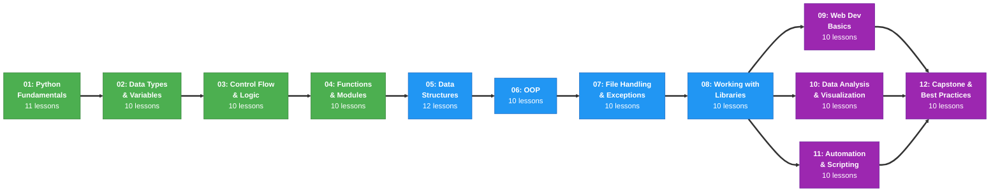
